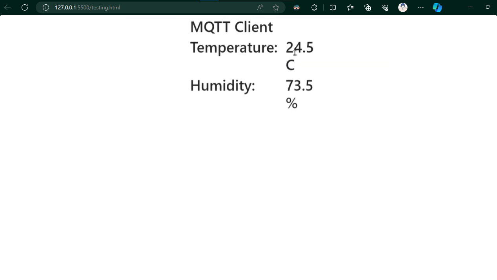

# Dokumentasi Project MQTT Kelompok 16
| No | Nama | NRP |
|---|---|---|
| 1 | Awang Fraditya | 50272221055 |
| 2 | Sighra Attariq Sumere Jati | 50272221068 |

# Project 1

## Must-Need Hardware:
1. ESP 8266 (NodeMCU)
2. Sensor DHT22
3. BreadBoard
4. Kabel Jumper

## Setup Hardware:
1. Pin Out DHT - D1 (NodeMCU)
2. Pin (+) DHT - 3v (NodeMCU)
3. Pin (-) DHT - GND (NodeMCU)

## Dokumentasi Alat:


## ESP8266 Code
Source code dibawah ini dapat kita gunakan untuk menjalankan sensor DHT22 dan NodeMCU:
```c
#include <Adafruit_Sensor.h>
#include <DHT.h>
#include <DHT_U.h>
#include <ESP8266WiFi.h>
#include <PubSubClient.h>


// Update these with values suitable for your network.

const char* ssid = "Sighra Jati"; //hotspot WIFI
const char* pswd = "sukasuka";

const char* mqtt_server = "152.42.194.14"; //Broker IP/URL
const char* topic = "/kel16/room/temperature";    //Topic
const char* username="sighra";
const char* password="awang";

long timeBetweenMessages = 1000 * 20 * 1;

WiFiClient espClient;
PubSubClient client(espClient);
long lastMsg = 0;
int value = 0;

int status = WL_IDLE_STATUS;     // the starting Wifi radio's status

#define DHTPIN 5    // Digital pin connected to the DHT sensor 

// Uncomment the type of sensor in use:
//#define DHTTYPE    DHT11     // DHT 11
#define DHTTYPE    DHT22     // DHT 22 (AM2302)
DHT_Unified dht(DHTPIN, DHTTYPE);

uint32_t delayMS;


void setup_wifi() {
  delay(10);
  // We start by connecting to a WiFi network
  Serial.println();
  Serial.print("Connecting to ");
  Serial.println(ssid);
  WiFi.begin(ssid, pswd);
  while (WiFi.status() != WL_CONNECTED) {
    delay(500);
    Serial.print(".");
  }
  Serial.println("");
  Serial.println("WiFi connected");
  Serial.println("IP address: ");
  Serial.println(WiFi.localIP());
}

void callback(char* topic, byte* payload, unsigned int length) {
  Serial.print("Message arrived [");
  Serial.print(topic);
  Serial.print("] ");
  for (int i = 0; i < length; i++) {
    Serial.print((char)payload[i]);
  }
  Serial.println();

  // Switch on the LED if an 1 was received as first character
  if ((char)payload[0] == '1') {
    digitalWrite(BUILTIN_LED, LOW);   // Turn the LED on (Note that LOW is the voltage level
    // but actually the LED is on; this is because
    // it is acive low on the ESP-01)
  } else {
    digitalWrite(BUILTIN_LED, HIGH);  // Turn the LED off by making the voltage HIGH
  }
}

String macToStr(const uint8_t* mac)
{
  String result;
  for (int i = 0; i < 6; ++i) {
    result += String(mac[i], 16);
    if (i < 5)
      result += ':';
  }
  return result;
}

String composeClientID() {
  uint8_t mac[6];
  WiFi.macAddress(mac);
  String clientId;
  clientId += "esp-";
  clientId += macToStr(mac);
  return clientId;
}

void reconnect() {
  // Loop until we're reconnected
  while (!client.connected()) {
    Serial.print("Attempting MQTT connection...");

    String clientId = composeClientID() ;
    clientId += "-";
    clientId += String(micros() & 0xff, 16); // to randomise. sort of

    // Attempt to connect
    if (client.connect(clientId.c_str(),username,password)) {
      Serial.println("connected");
      String subscription;
      subscription += topic;
      subscription += "/";
      subscription += composeClientID() ;
      subscription += "/in";
      client.subscribe(subscription.c_str() );
      Serial.print("subscribed to : ");
      Serial.println(subscription);
    } else {
      Serial.print("failed, rc=");
      Serial.print(client.state());
      Serial.print(" wifi=");
      Serial.print(WiFi.status());
      Serial.println(" try again in 5 seconds");
      // Wait 5 seconds before retrying
      delay(5000);
    }
  }
}

void setup() {
  Serial.begin(115200);
  // Initialize device.
  dht.begin();

  //Setup WIFI & MQTT Broker connection
  setup_wifi();
  client.setServer(mqtt_server, 1883);
  client.setCallback(callback);
  
  Serial.println(F("DHTxx Unified Sensor Example"));
  // Print temperature sensor details.
  sensor_t sensor;
  dht.temperature().getSensor(&sensor);
  Serial.println(F("------------------------------------"));
  Serial.println(F("Temperature Sensor"));
  Serial.print  (F("Sensor Type: ")); Serial.println(sensor.name);
  Serial.print  (F("Driver Ver:  ")); Serial.println(sensor.version);
  Serial.print  (F("Unique ID:   ")); Serial.println(sensor.sensor_id);
  Serial.print  (F("Max Value:   ")); Serial.print(sensor.max_value); Serial.println(F("°C"));
  Serial.print  (F("Min Value:   ")); Serial.print(sensor.min_value); Serial.println(F("°C"));
  Serial.print  (F("Resolution:  ")); Serial.print(sensor.resolution); Serial.println(F("°C"));
  Serial.println(F("------------------------------------"));
  // Print humidity sensor details.
  dht.humidity().getSensor(&sensor);
  Serial.println(F("Humidity Sensor"));
  Serial.print  (F("Sensor Type: ")); Serial.println(sensor.name);
  Serial.print  (F("Driver Ver:  ")); Serial.println(sensor.version);
  Serial.print  (F("Unique ID:   ")); Serial.println(sensor.sensor_id);
  Serial.print  (F("Max Value:   ")); Serial.print(sensor.max_value); Serial.println(F("%"));
  Serial.print  (F("Min Value:   ")); Serial.print(sensor.min_value); Serial.println(F("%"));
  Serial.print  (F("Resolution:  ")); Serial.print(sensor.resolution); Serial.println(F("%"));
  Serial.println(F("------------------------------------"));
  // Set delay between sensor readings based on sensor details.
  delayMS = 30000;
}

void loop() {
  // Delay between measurements.
  delay(delayMS);
  // Get temperature event and print its value.
  sensors_event_t event;
  dht.temperature().getEvent(&event);
  float temp=0;
  if (isnan(event.temperature)) {
    Serial.println(F("Error reading temperature!"));
  }
  else {
    Serial.print(F("Temperature: "));
    Serial.print(event.temperature);
    Serial.println(F("°C"));
    temp=event.temperature;
  }

  // Get humidity event and print its value.
  dht.humidity().getEvent(&event);
  float hum=0;
  if (isnan(event.relative_humidity)) {
    Serial.println(F("Error reading humidity!"));
  }
  else {
    Serial.print(F("Humidity: "));
    Serial.print(event.relative_humidity);
    Serial.println(F("%"));
    hum=event.relative_humidity;
  }
    // confirm still connected to mqtt server
  if (!client.connected()) {
    reconnect();
  }
  client.loop();

  String payload = "{\"Temp\":";
  payload += temp;
  payload += ",\"Hum\":";
  payload += hum;
  payload += "}";
  String pubTopic;
   pubTopic += topic;
  Serial.print("Publish topic: ");
  Serial.println(pubTopic);
  Serial.print("Publish message: ");
  Serial.println(payload);
  client.publish( (char*) pubTopic.c_str() , (char*) payload.c_str(), true );

  delay(5000);
}
```

Upload code di atas untuk menjalankan modul ESP8266 dan juga menghubungkannya ke sensor DHT22.

## HTML Code
Gunakan code dibawah ini untuk menjalankan web clientnya:
```html
<!doctype html>
<html lang="en">
  <head>
    <title>Kelompok 16</title>
    <!-- Required meta tags -->
    <meta charset="utf-8">
    <meta name="viewport" content="width=device-width, initial-scale=1, shrink-to-fit=no">

    <!-- Bootstrap CSS -->
    <link rel="stylesheet" href="https://stackpath.bootstrapcdn.com/bootstrap/4.3.1/css/bootstrap.min.css" integrity="sha384-ggOyR0iXCbMQv3Xipma34MD+dH/1fQ784/j6cY/iJTQUOhcWr7x9JvoRxT2MZw1T" crossorigin="anonymous">
  </head>
  <body>
      <div class="continer-fluid">
          <div class="row justify-content-center">
              <div class="col-3">
                <h1>MQTT Client</h1>
              </div>
          </div>
          <div class="row justify-content-center">
            <div class="col-2">
              <h1>Temperature:</h1>
            </div>
            <div class="col-1">
                <h1 id="Room-Temp">2</h1>
              </div>
        </div>
        <div class="row justify-content-center">
            <div class="col-2">
              <h1>Humidity:</h1>
            </div>
            <div class="col-1">
                <h1 id="Room-Hum">2</h1>
              </div>
        </div>

      </div>
    <!-- Optional JavaScript -->
    <!-- jQuery first, then Popper.js, then Bootstrap JS -->
    <script src="https://code.jquery.com/jquery-3.3.1.slim.min.js" integrity="sha384-q8i/X+965DzO0rT7abK41JStQIAqVgRVzpbzo5smXKp4YfRvH+8abtTE1Pi6jizo" crossorigin="anonymous"></script>
    <script src="https://cdnjs.cloudflare.com/ajax/libs/popper.js/1.14.7/umd/popper.min.js" integrity="sha384-UO2eT0CpHqdSJQ6hJty5KVphtPhzWj9WO1clHTMGa3JDZwrnQq4sF86dIHNDz0W1" crossorigin="anonymous"></script>
    <script src="https://stackpath.bootstrapcdn.com/bootstrap/4.3.1/js/bootstrap.min.js" integrity="sha384-JjSmVgyd0p3pXB1rRibZUAYoIIy6OrQ6VrjIEaFf/nJGzIxFDsf4x0xIM+B07jRM" crossorigin="anonymous"></script>

    <!--MQTT Poho Javascript Library-->
    <script src="https://cdnjs.cloudflare.com/ajax/libs/paho-mqtt/1.0.1/mqttws31.min.js" type="text/javascript"></script>
    <script type="text/javascript">
        $(document).ready(function(){

            /** Write Your MQTT Settings Here  Start**/
            Server="152.42.194.14";
            Port="9000";
            Topic="/kel16/room/temperature";
            MQTTUserName="sighra";
            MQTTPassword="awang";
            /** Write Your MQTT Settings Here End **/

            // Generate a random client ID
            clientID = "clientID_" + parseInt(Math.random() * 100);

            // Create a client instance
            client=new Paho.MQTT.Client(Server,Number(Port),clientID);


            // set callback handlers
            client.onConnectionLost = onConnectionLost;
            client.onMessageArrived = onMessageArrived;

            options = {
              userName:MQTTUserName,
              password:MQTTPassword,
              timeout: 3,
              //Gets Called if the connection has successfully been established
              onSuccess: function () {
                  onConnect();
              },
              //Gets Called if the connection could not be established
              onFailure: function (message) {
                  console.log("On failure="+message.errorMessage);
                  onFailt(message.errorMessage);
                  //alert("Connection failed: " + message.errorMessage);
              }
            };
            // connect the client
            client.connect(options);
        });

        // called when the client connects
        function onConnect() {
            // Once a connection has been made, make a subscription and send a message.
            console.log("onConnect");
            client.subscribe(Topic);
        }

        // called when the client loses its connection
        function onConnectionLost(responseObject) {
            if (responseObject.errorCode !== 0) {
                console.log("onConnectionLost:"+responseObject.errorMessage);
            }
        }

        // called when a message arrives
        function onMessageArrived(message) {
            var MQTTDataObject = JSON.parse(message.payloadString);
            $("#Room-Temp").text(MQTTDataObject.Temp+" C");
            $("#Room-Hum").text(MQTTDataObject.Hum+" %");
            console.log(MQTTDataObject.Hum);
            console.log(MQTTDataObject.Temp);
             console.log("onMessageArrived:"+message.payloadString);
        }
    </script>
  </body>
</html>
```

Kemudian setelah meng-copy code diatas, kita dapat melihat hasil HTML sebagai berikut:



Berikut merupakan demo kami untuk Project 1 (MQTT Temp Sensor):


https://github.com/sgraa/Final-Project-IS/assets/77944902/33e4a961-9de0-4ab5-8647-149d51ea9794

# Project 2

## Must-Need Hardware:
1. Raspberry Pi
2. Sensor DHT22
3. BreadBoard
4. Kabel Jumper
6. Lampu LED Mini

## Dokumentasi Alat:


## MQTT Code
Source code dibawah ini dapat kita gunakan untuk menghubungkan sensor DHT22 dan Raspberry Pi (Via MQTT):

**MQTT Public**
```py
import paho.mqtt.client as mqtt
import json

def on_connect(client, userdata, flags, rc):
    # subscribe, which need to put into on_connect
    # if reconnect after losing the connection with the broker, it will continue to subscribe to the raspberry/topic topic
    client.subscribe("/kel16/room/temperature")

# the callback function, it will be triggered when receiving messages
def on_message(client, userdata, message):
    readings=str(message.payload.decode("utf-8"))
    print("message received " ,readings)
    JsonReadings=json.loads(readings)
    print("Temperature=",JsonReadings["Temp"])
    if JsonReadings["Temp"]>30:
        client.publish("/kel16/room/led","On")
    else:
        client.publish("/kel16/room/led","Off")

client = mqtt.Client()
client.on_connect = on_connect
client.on_message = on_message
# create connection, the three parameters are broker address, broker port number, and keep-alive time respectively
client.username_pw_set(username="sighra",password="awang")
client.connect("152.42.194.14", 1883, 60)
# set the network loop blocking, it will not actively end the program before calling disconnect() or the program crash
client.loop_forever()
```

**MQTT Subscribe**
```python
import paho.mqtt.client as mqtt
import RPi.GPIO as GPIO # Import Raspberry Pi GPIO library
from time import sleep # Import the sleep function from the time module

GPIO.setwarnings(False) # Ignore warning for now
GPIO.setmode(GPIO.BOARD) # Use physical pin numbering
GPIO.setup(12, GPIO.OUT, initial=GPIO.LOW) # Set pin 8 to be an output pin and$

def on_connect(client, userdata, flags, rc):
    # subscribe, which need to put into on_connect
    # if reconnect after losing the connection with the broker, it will continue to subscribe to the raspberry/topic topic
    client.subscribe("/kel16/room/led")

# the callback function, it will be triggered when receiving messages
def on_message(client, userdata, message):
    if str(message.payload.decode("utf-8"))=="On":
        GPIO.output(12, GPIO.HIGH) # Turn on
    else:
        GPIO.output(12, GPIO.LOW) # Turn Off
    print("message received " ,str(message.payload.decode("utf-8")))
    
client = mqtt.Client()
client.on_connect = on_connect
client.on_message = on_message
# create connection, the three parameters are broker address, broker port number, and keep-alive time respectively
client.username_pw_set(username="sighra",password="awang")
client.connect("152.42.194.14", 1883, 60)
# set the network loop blocking, it will not actively end the program before calling disconnect() or the program crash
client.loop_forever()
```

Upload code di atas untuk menjalankan modul Raspberry Pi dan juga menghubungkannya ke sensor DHT22.

## HTML Code
Gunakan code dibawah ini untuk menjalankan web clientnya:
```html
<!DOCTYPE html>
<html lang="en">
  <head>
    <title>Kelompok 6</title>
    <!-- Required meta tags -->
    <meta charset="utf-8" />
    <meta name="viewport" content="width=device-width, initial-scale=1, shrink-to-fit=no" />

    <!-- Bootstrap CSS -->
    <link rel="stylesheet" href="https://stackpath.bootstrapcdn.com/bootstrap/4.3.1/css/bootstrap.min.css" integrity="sha384-ggOyR0iXCbMQv3Xipma34MD+dH/1fQ784/j6cY/iJTQUOhcWr7x9JvoRxT2MZw1T" crossorigin="anonymous" />
  </head>
  <body>
    <div class="continer-fluid">
      <div class="row justify-content-center">
        <div class="col-3">
          <h1>MQTT Client</h1>
        </div>
      </div>
      <div class="row justify-content-center">
        <div class="col-2">
          <h1>Temperature:</h1>
        </div>
        <div class="col-1">
          <h1 id="Room-Temp">2</h1>
        </div>
      </div>
      <div class="row justify-content-center">
        <div class="col-2">
          <h1>Humidity:</h1>
        </div>
        <div class="col-1">
          <h1 id="Room-Hum">2</h1>
        </div>
      </div>

      <div class="row justify-content-center">
        <div class="col-2">
          <h1>Light:</h1>
        </div>
        <div class="col-1">
          <button class="btn btn-primary" id="btnLed">On</button>
        </div>
      </div>
    </div>
    <!-- Optional JavaScript -->
    <!-- jQuery first, then Popper.js, then Bootstrap JS -->
    <script src="https://code.jquery.com/jquery-3.3.1.slim.min.js" integrity="sha384-q8i/X+965DzO0rT7abK41JStQIAqVgRVzpbzo5smXKp4YfRvH+8abtTE1Pi6jizo" crossorigin="anonymous"></script>
    <script src="https://cdnjs.cloudflare.com/ajax/libs/popper.js/1.14.7/umd/popper.min.js" integrity="sha384-UO2eT0CpHqdSJQ6hJty5KVphtPhzWj9WO1clHTMGa3JDZwrnQq4sF86dIHNDz0W1" crossorigin="anonymous"></script>
    <script src="https://stackpath.bootstrapcdn.com/bootstrap/4.3.1/js/bootstrap.min.js" integrity="sha384-JjSmVgyd0p3pXB1rRibZUAYoIIy6OrQ6VrjIEaFf/nJGzIxFDsf4x0xIM+B07jRM" crossorigin="anonymous"></script>

    <!--MQTT Poho Javascript Library-->
    <script src="https://cdnjs.cloudflare.com/ajax/libs/paho-mqtt/1.0.1/mqttws31.min.js" type="text/javascript"></script>
    <script type="text/javascript">
      $(document).ready(function () {
        /** Write Your MQTT Settings Here  Start**/
        Server = "152.42.194.14";
        Port = "1883";
        Topic = "/kel16/room/temperature";
        LedTopic = "/kel16/room/led";
        MQTTUserName = "sighra";
        MQTTPassword = "awang";
        Connected = false;
        /** Write Your MQTT Settings Here End **/

        // Generate a random client ID
        clientID = "clientID_" + parseInt(Math.random() * 100);

        // Create a client instance
        client = new Paho.MQTT.Client(Server, Number(Port), clientID);

        // set callback handlers
        client.onConnectionLost = onConnectionLost;
        client.onMessageArrived = onMessageArrived;

        options = {
          userName: MQTTUserName,
          password: MQTTPassword,
          timeout: 3,
          //Gets Called if the connection has successfully been established
          onSuccess: function () {
            onConnect();
          },
          //Gets Called if the connection could not be established
          onFailure: function (message) {
            console.log("On failure=" + message.errorMessage);
            onFailt(message.errorMessage);
            //alert("Connection failed: " + message.errorMessage);
          },
        };
        // connect the client
        client.connect(options);

        /***LED Button Code Start ***/
        $("#btnLed").click(function () {
          if ($("#btnLed").text() == "On") {
            console.log("On");
            $("#btnLed").text("Off");
            TurnOnOffLed("On");
          } else {
            console.log("Off");
            $("#btnLed").text("On");
            TurnOnOffLed("Off");
          }
        });
        /***LED Button Code End ***/
      });

      /***LED Button Function Start ***/
      function TurnOnOffLed(Signal) {
        if (Connected) {
          if (Signal == "On") {
            message = new Paho.MQTT.Message("On");
          } else {
            message = new Paho.MQTT.Message("Off");
          }
          message.destinationName = LedTopic;
          client.send(message);
        }
      }
      /***LED Button Function End ***/

      // called when the client connects
      function onConnect() {
        // Once a connection has been made, make a subscription and send a message.
        console.log("onConnect");
        client.subscribe(Topic);
        Connected = true;
      }

      // called when the client loses its connection
      function onConnectionLost(responseObject) {
        if (responseObject.errorCode !== 0) {
          console.log("onConnectionLost:" + responseObject.errorMessage);
        }
        Connected = false;
      }

      // called when a message arrives
      function onMessageArrived(message) {
        var MQTTDataObject = JSON.parse(message.payloadString);
        $("#Room-Temp").text(MQTTDataObject.Temp + " C");
        $("#Room-Hum").text(MQTTDataObject.Hum + " %");
        console.log(MQTTDataObject.Hum);
        console.log(MQTTDataObject.Temp);
        console.log("onMessageArrived:" + message.payloadString);
      }
    </script>
  </body>
</html>
```

Kemudian setelah meng-copy code diatas, kita dapat melihat hasil HTML sebagai berikut:


Berikut merupakan demo kami untuk Project 2 (MQTT Raspberry Pi Temp Sensor):

https://github.com/sgraa/Final-Project-IS/assets/77944902/6b02ef02-e9cd-4be9-a7b9-fa722b8f25c7

# Playlist Seluruh Video Project Integrasi Sistem Kelompok 16
[Klik Disini Untuk Mengakses Playlist](https://www.youtube.com/playlist?list=PLgqqETnX7yBTv3LYEsaWzaY-j_-A9vEAC)
